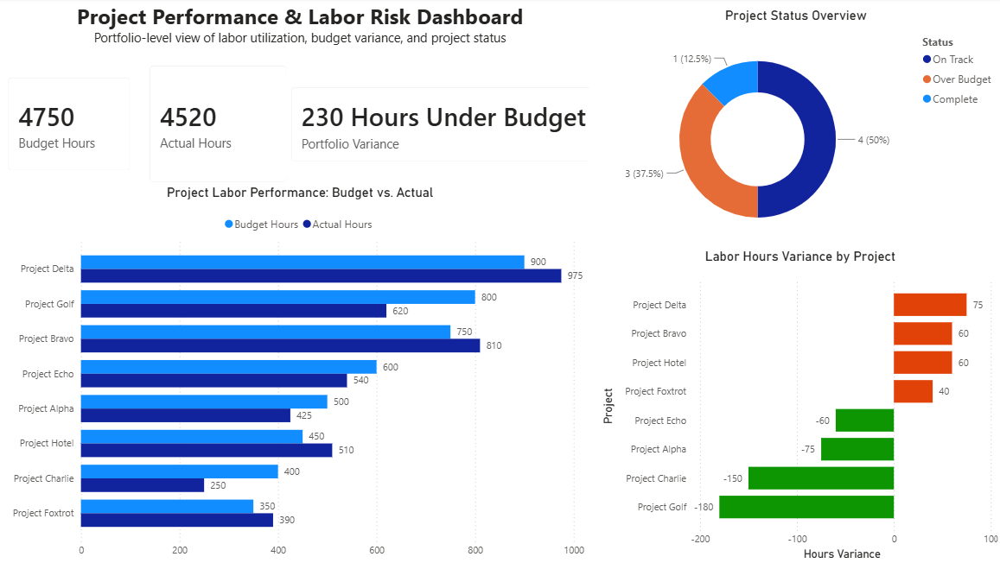

# Business KPI Tracker

## Project Overview

This project demonstrates how operational project data can be analyzed to identify labor overruns, detect project risk, and provide management-level KPI visibility.

The analysis uses SQL to compare budgeted labor hours, actual labor usage, and project completion to identify performance issues before they become larger budget problems.

## Dashboard Preview

## Business Questions

The analysis was designed to answer:

- Which projects have exceeded their labor budgets?
- Which projects may be at risk before exceeding budget?
- How much of the labor budget has been consumed relative to project completion?
- Which departments are performing above or below their combined labor budgets?
- Where should management focus attention?

## Dataset

The project uses a fictional project-management dataset containing:

- Project ID
- Project name
- Department
- Budgeted labor hours
- Actual labor hours
- Percent complete
- Project status

Fictional data is used so the project can demonstrate realistic business-analysis techniques without exposing proprietary company information.

## SQL Analysis

### 1. Project Budget Variance

Calculates the difference between actual and budgeted labor hours and identifies projects that have exceeded their budgets.

### 2. Project Risk Identification

Compares the percentage of labor budget consumed with the percentage of project completion.

Projects are classified as:

- **Over Budget** — Actual labor hours exceed budgeted hours
- **At Risk** — Labor consumption is at least 10 percentage points ahead of project completion
- **On Track** — Project does not meet either risk condition

This provides an early-warning indicator rather than waiting until a project has already exceeded its labor budget.

### 3. Department Performance

Aggregates project data by department to provide management-level visibility into labor performance.

## Key Findings

Using the sample dataset:

- Engineering managed 5 projects with 2,950 total budgeted labor hours.
- Engineering consumed 3,110 hours, exceeding its combined labor budget by **160 hours**.
- Engineering consumed **105.4%** of its total allocated labor hours.
- Operations managed 3 projects with 1,800 budgeted hours and used 1,410 hours.
- Operations remained **390 hours under budget**, consuming **78.3%** of allocated labor hours.
- Project-level risk analysis identified multiple Engineering projects contributing to the overall labor overage.

## Skills Demonstrated

- SQL
- Power BI dashboard development
- Power Query data transformation
- DAX measures and calculations
- Business data analysis
- Data visualization
- KPI development
- Project performance analysis
- Budget variance analysis
- Risk identification and early-warning indicators
- Conditional logic
- Aggregate analysis
- Management and executive reporting
- Translating operational data into actionable business insights

### SQL Techniques

`SELECT` • `WHERE` • `CASE` • `ROUND` • `COUNT` • `SUM` • `GROUP BY` • `ORDER BY` • Calculated Fields

## Tools

- SQL / SQLite
- Power BI
- Power Query
- DAX
- GitHub

## Power BI Dashboard

An interactive Power BI dashboard was developed to translate the SQL analysis into management-level reporting.

The dashboard includes:

- Executive KPI summary of budgeted vs. actual labor hours
- Portfolio labor variance
- Project-level budget vs. actual comparison
- Project status distribution
- Conditional variance indicators highlighting projects over and under budget
- DAX measures for dynamic portfolio-level analysis
- Power Query transformations for data preparation

## Project Files

- `sample-data.csv` — fictional source dataset
- `analysis.sql` — SQL queries used for project and department analysis
- `Business-KPI-Tracker.pbix` — interactive Power BI report
- `Dashboard-Preview.png` — dashboard preview
---

*This project is part of a business analytics portfolio focused on using data to identify operational risks, improve visibility, and support management decision-making.*
